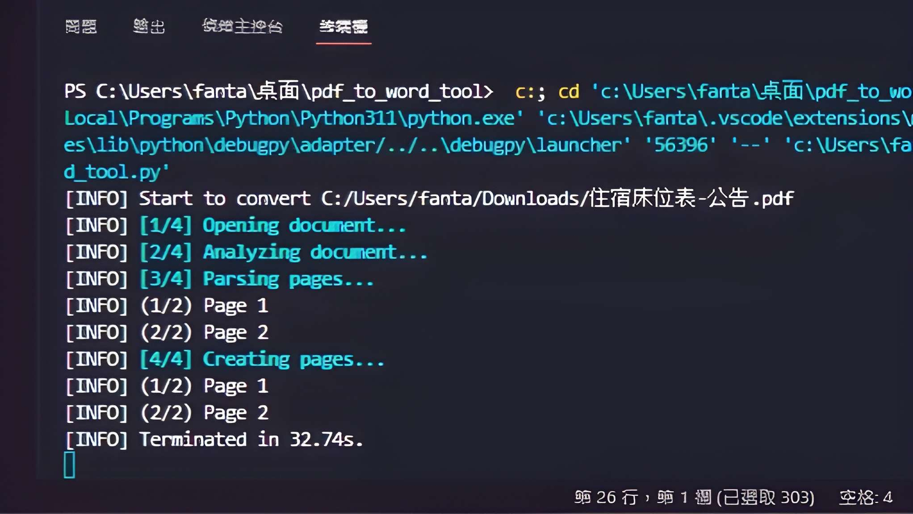

# PDF 轉 Word 工具

這是一個使用 Python 和 Tkinter 構建的 GUI 工具，用於將 PDF 文件轉換為 Word 文檔。使用者可以將要轉換的 PDF 文件拖放到界面上，選擇轉換後的輸出路徑，然後進行轉換操作。

## 功能簡介

- 拖放 PDF：通過將 PDF 文件拖放到標籤上，實現文件的拖放操作。
- 指定輸出路徑：使用者可以手動輸入或選擇轉換後的 Word 文檔的輸出路徑。
- 開始轉換：按下按鈕後，將 PDF 文件轉換為 Word 文檔。
- 轉換提示：轉換完成後，會顯示提示框，通知使用者轉換已完成。

## 範例演示




## 使用方法

1. 在終端或命令提示符中，使用以下命令運行 `pdf_to_word_tool.py` 程序文件。

2. 程序窗口將打開，包含以下功能：
   - `將 PDF 文件拖放到此處` 標籤：將要轉換的 PDF 文件拖放到這個標籤區域。
   - `指定輸出路徑`：手動輸入或點擊按鈕以瀏覽和選擇轉換後的 Word 文檔儲存路徑。
   - `開始轉換` 按鈕：點擊按鈕開始將 PDF 文件轉換為 Word 文檔。
   - 轉換提示：轉換完成後，會顯示提示框，通知使用者轉換已完成。

3. 點擊 `將 PDF 文件拖放到此處` 標籤，將要轉換的 PDF 文件拖放到標籤區域。

4. 在 `指定輸出路徑` 文本框中，手動輸入或點擊按鈕以瀏覽和選擇轉換後的 Word 文檔儲存路徑。

5. 點擊 `開始轉換` 按鈕，程式將根據您的設定開始將 PDF 文件轉換為 Word 文檔。

6. 轉換完成後，您將在程式中看到轉換後的 Word 文檔。

## 環境要求

- Python 3.x 版本
- Tkinter 庫
- pdf2docx 庫
- tkinterdnd2 庫

## 安裝步驟

1. 使用 `git clone` 命令或下載 ZIP 壓縮檔，將程式複製到您的計算機中。

2. 在命令提示符中，進入程式所在的文件夾。

3. 使用以下命令安裝必要的庫：
    ```
    pip install tkinter
    ```

    ```
    pip install pdf2docx
    ```

    ```
    pip install tkinterdnd2
    ```

4. 使用以下命令運行程式：
    ```
    python pdf_to_word_tool.py
    ```

## 授權信息

本程式遵循 [MIT 授權](LICENSE.txt)，您可以自由使用、修改和分享本程式。